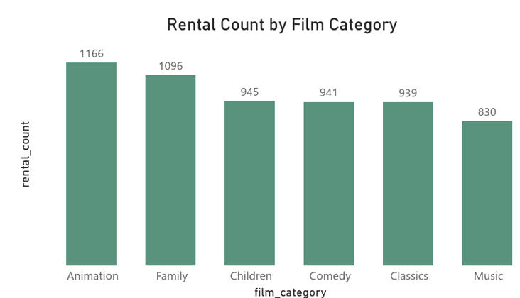
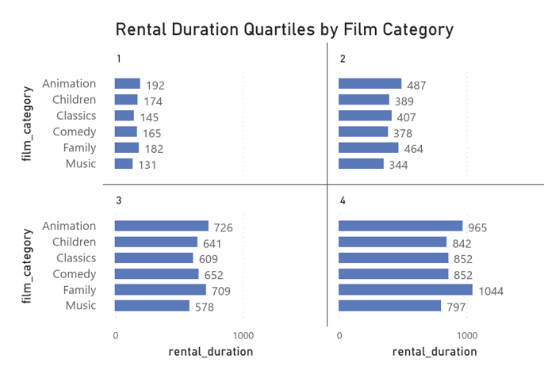
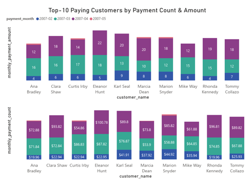
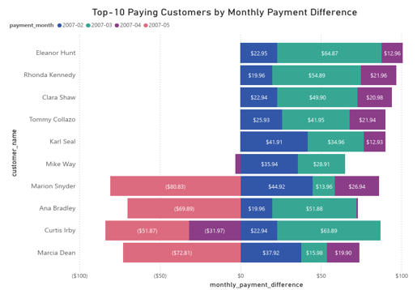

# Claire's Data Science Portfolio

# [Project 1: Used Car Price Estimator](https://github.com/claireon/Used-Car-Pricing-Model) 
* Created a regrssion model that estimates the prices of used cars to help potential buyers determine their budgets based on the car features.
* The user can insert car brand, body type, year, engine version, registration status and mileage, and the model can predict with 89% accuracy, how much it will cost them.

# [Project 2: US University Analysis Based on Forbes Ranking](https://github.com/claireon/Analysis-of-Top-American-Colleges) 
- The package contains a Jupyter Python Notebook file where I perform anaylysis on the top ranking colleges in the US and try to determine the effect of rank on factors such as Costs, Admittance rate, Alumni salaries.
- The analysis can help with college decisions for students considering several college choices, particularly in the US
- It can also be utilised for decisions regarding college where personal funding is limited

## Notes
- The model uses simple Seaborn visualisations to show the relationships
- This notebook takes you through the process of performing an analysis on college ranking data to determine factors influenced by a college ranking.

 

# [Project 3: Investigation of the Sakila DVD Rental database](https://github.com/claireon/dvdrentals-sql) 
- In this project, I use SQL to explore a database related to movie rentals. I wrote SQL code to run SQL queries and answer interesting questions about the database.
- The package contains four sql scripts (.sql files) where I perform anaylysis on a movie rental store database in order to answer some business questions.

## Notes
- movies_families_are_watching.sql analyses the most watched family movies in the rental store\

- family_movies_rental_duration.sql analyses the durations of the rented family movies

- top_10_customers.sql explores and the top 10 customers of the store

- top_10_customer_monthly_payment_differences.sql aims to evaluate the differences in monthly payments by the top 10 customers

<a class="badge-base__link LI-simple-link" href="https://ng.linkedin.com/in/claire-opia?trk=profile-badge">LinkedIn</a>

